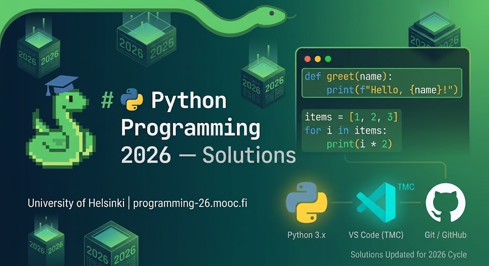

  

# 🐍 Python Programming MOOC 2026 — Solutions

Solutions for the **[Python Programming MOOC 2026](https://programming-26.mooc.fi/)** course by the University of Helsinki.

---

## 🛠 Tools & Environment

* **Language:** Python 3.x
* **IDE:** VS Code (TMC Plugin)
* **VCS:** Git / GitHub

---

## ⚠️ Academic Integrity

> Solutions are published solely for portfolio purposes. If you are currently taking this course, please try to solve the exercises on your own.
